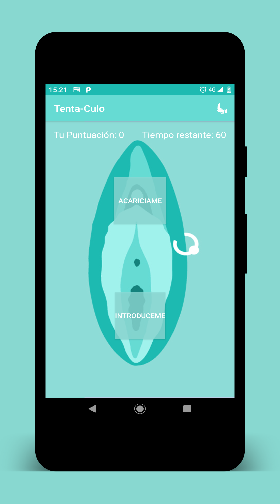
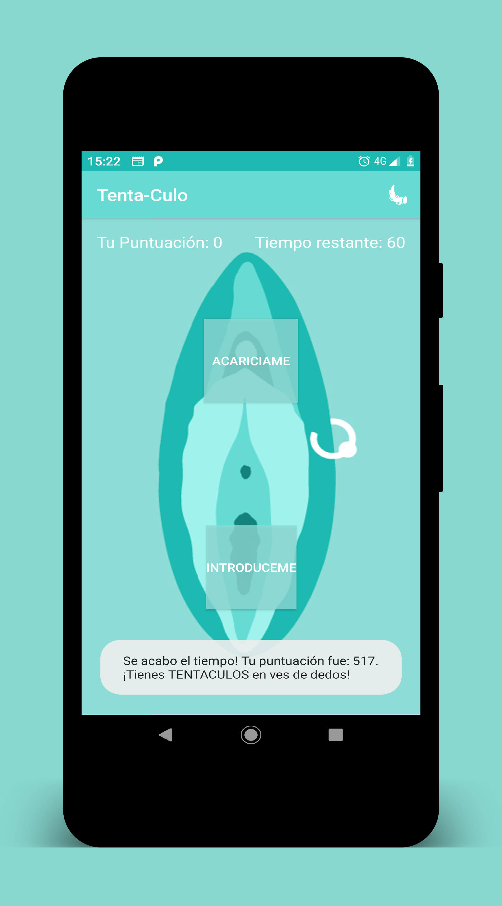
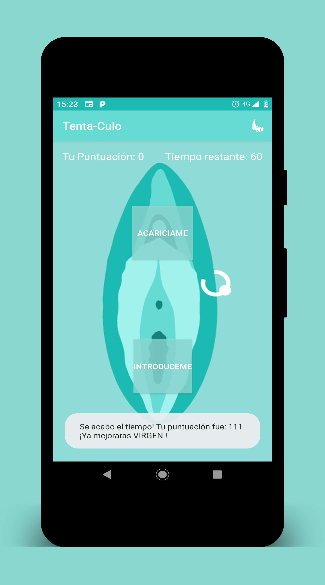
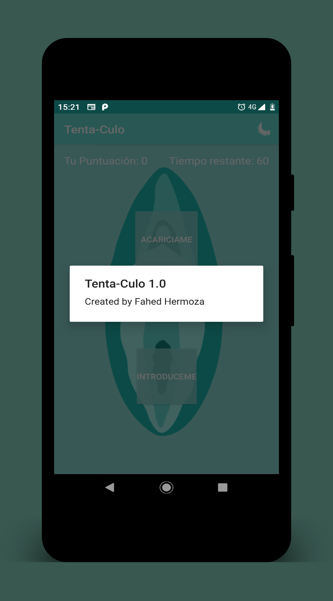

App TentaCulo
=======================================

 

La app TentaCulo supuesta app que promete convertirte en un experto en la masturbación femenina. ¡Al final del training tendras Tenta-Culos en ves de manos!

## Aprendizaje
En esta aplicación se explora los aspectos básicos de los proyectos android:
- Kotlin
- Las activity. 
- Los layout. 
- Countdown timer. 
- La depuracion de apps. 
- UI.

## Screenshot

        
        
        
        

        
        
        
        

## Buscar más aplicaciones
Echa un vistazo al [proyecto principal](https://github.com/FahedHermoza/AndroidBooks#1-programaci%C3%B3n-con-android)
