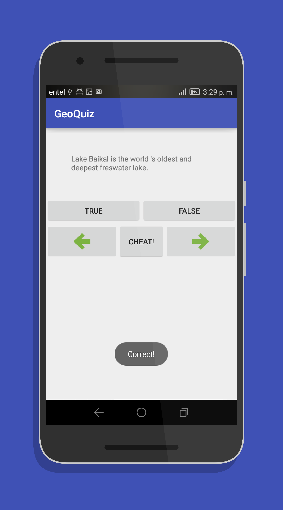
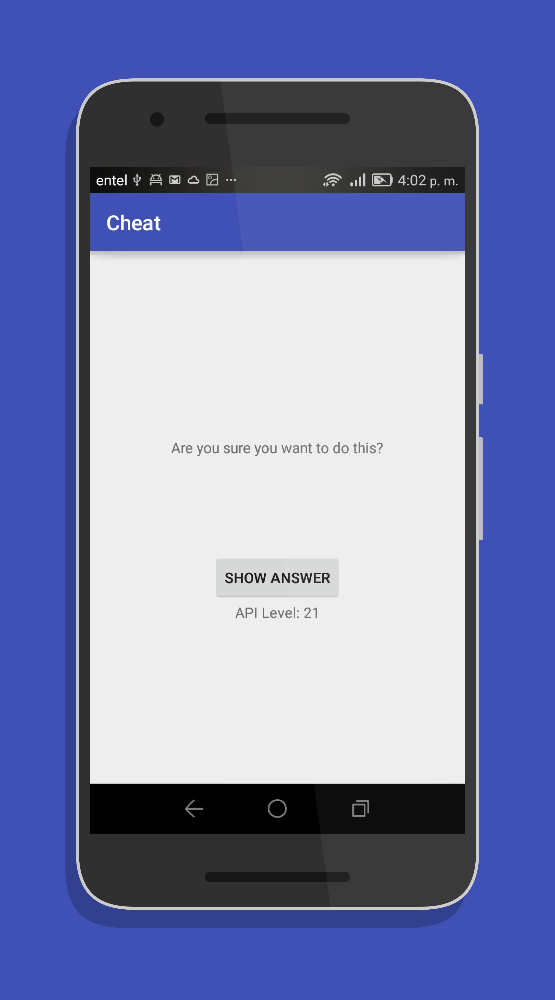

App GeoQuiz
=======================================

 

La app GeoQuiz comprueba los conocimientos geográficos del usuario, donde el usuario deberá pulsar TRUE (verdadero) o FALSE (falso) para responder a la pregunta que aparezca en pantalla y también cuenta con la opción para hacer Trampa.

## Aprendizaje
En esta aplicación se explora los aspectos básicos de los proyectos android:
- Las activity. 
- Los layout. 
- Los intent explicitos. 
- Patron MVC (Modelo Vista Controlador).
- La depuracion de apps. 
- Versiones del SDK de android y compatibilidad.

## Screenshot

        
        
        
        

## Buscar más aplicaciones
Echa un vistazo al [proyecto principal](https://github.com/FahedHermoza/AndroidBooks#1-programaci%C3%B3n-con-android)
